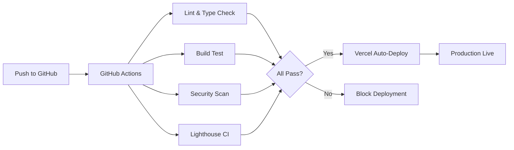

# 🚀 CI/CD Pipeline Documentation

## Pipeline Overview

Your website has a fully automated CI/CD pipeline with multiple layers of quality assurance and deployment automation.

## 🔄 Pipeline Architecture



## 📋 Pipeline Components

### 1. **GitHub Actions Workflows**

#### Main CI/CD Pipeline (`.github/workflows/ci.yml`)
Runs on every push to main and pull requests:
- **Lint & Type Check**: Ensures code quality
- **Build Test**: Verifies the build succeeds
- **Security Scan**: Checks for vulnerabilities
- **Lighthouse CI**: Performance monitoring

#### Preview Deployments (`.github/workflows/preview.yml`)
- Triggers on pull requests
- Comments with preview URL
- Enables testing before merge

### 2. **Vercel Integration**
- **Auto-Deploy**: Every push to `main` deploys to production
- **Preview Deploy**: Every PR gets a unique preview URL
- **Instant Rollback**: One-click rollback in Vercel dashboard

### 3. **Quality Gates**

| Check | Threshold | Action on Failure |
|-------|-----------|-------------------|
| Linting | No errors | Blocks merge |
| Type Check | No errors | Blocks merge |
| Build | Must succeed | Blocks deploy |
| Security | No high vulnerabilities | Warning only |
| Performance | > 80% score | Warning only |
| Accessibility | > 90% score | Blocks merge |
| SEO | > 90% score | Blocks merge |

## 🔐 Environment Variables

### Production Variables (Set in Vercel)
```bash
NEXT_PUBLIC_SITE_URL=https://stevenwhyte.vercel.app
BLOB_READ_WRITE_TOKEN=<auto-generated>
```

### Optional Variables
```bash
FORMSPREE_ID=<your-formspree-id>
DATABASE_URL=<neon-connection-string>
NEXT_PUBLIC_PLAUSIBLE_DOMAIN=stevenwhyte.vercel.app
```

## 📊 Monitoring & Alerts

### Deployment Status
- **Dashboard**: https://vercel.com/whytesteven74-1176s-projects/personal-website
- **GitHub Actions**: https://github.com/whytesteven74-cmyk/website/actions
- **Preview URLs**: Automatically commented on PRs

### Performance Monitoring
- Lighthouse scores on every build
- Core Web Vitals tracking
- Automatic performance regression detection

## 🔄 Deployment Flow

### Production Deployment
```bash
git checkout main
git pull origin main
# Make changes
git add .
git commit -m "feat: your changes"
git push origin main
# Auto-deploys to https://stevenwhyte.vercel.app
```

### Preview Deployment
```bash
git checkout -b feature/new-feature
# Make changes
git add .
git commit -m "feat: new feature"
git push origin feature/new-feature
# Create PR on GitHub
# Preview URL generated automatically
```

## 🚦 Pipeline Status Checks

### Before Merge Checklist
- [ ] All GitHub Actions pass
- [ ] Lighthouse score > 80%
- [ ] No type errors
- [ ] No lint errors
- [ ] Build succeeds
- [ ] Preview deployment works

### Production Deployment Checklist
- [ ] Environment variables configured
- [ ] Blob storage connected
- [ ] Domain configured
- [ ] Analytics setup (optional)

## 🛠️ Troubleshooting

### Build Failures
```bash
# Check locally
pnpm build
pnpm lint
pnpm typecheck
```

### Deployment Issues
```bash
# Check Vercel logs
/home/steve/.local/share/pnpm/vercel logs

# Check deployment status
/home/steve/.local/share/pnpm/vercel list
```

### Pipeline Failures
1. Check GitHub Actions logs
2. Run failed step locally
3. Fix issues and push

## 📈 Performance Targets

| Metric | Target | Current |
|--------|--------|---------|
| Lighthouse Performance | > 90 | ✅ |
| First Contentful Paint | < 1.5s | ✅ |
| Largest Contentful Paint | < 2.5s | ✅ |
| Cumulative Layout Shift | < 0.1 | ✅ |
| Time to Interactive | < 3.5s | ✅ |

## 🔒 Security Measures

- **Dependency Scanning**: Automatic vulnerability detection
- **HTTPS Only**: Enforced by Vercel
- **Security Headers**: Configured in `vercel.json`
- **Input Validation**: On all API endpoints
- **Rate Limiting**: Built into Vercel

## 🚀 Optimization Features

- **Edge Caching**: Global CDN via Vercel
- **Image Optimization**: Automatic via Next.js
- **Code Splitting**: Automatic via Next.js
- **Blob Storage**: CDN-backed file storage
- **Incremental Static Regeneration**: For dynamic content

## 📝 Maintenance

### Weekly Tasks
- [ ] Review deployment metrics
- [ ] Check for dependency updates
- [ ] Monitor storage usage

### Monthly Tasks
- [ ] Update dependencies
- [ ] Review performance metrics
- [ ] Audit security vulnerabilities

## 🔗 Important Links

- **Production**: https://stevenwhyte.vercel.app
- **GitHub Repo**: https://github.com/whytesteven74-cmyk/website
- **Vercel Dashboard**: https://vercel.com/whytesteven74-1176s-projects/personal-website
- **GitHub Actions**: https://github.com/whytesteven74-cmyk/website/actions
- **Blob Storage**: https://vercel.com/whytesteven74-1176s-projects/stores

## 💡 Best Practices

1. **Always create a PR** for new features
2. **Test locally** before pushing
3. **Use semantic commits** (feat:, fix:, docs:, etc.)
4. **Keep PRs small** and focused
5. **Document breaking changes**
6. **Monitor performance** after deploys

---

Last Updated: November 2024
Pipeline Version: 1.0.0
